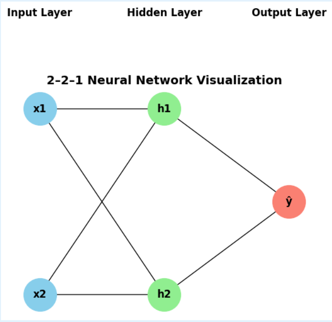
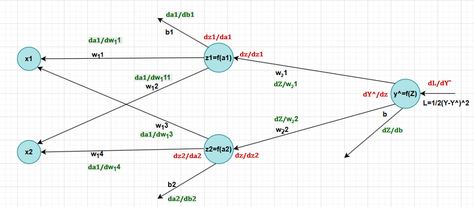

# Calculus in Neural Networks  
*A mathematical and computational walkthrough of backpropagation in a simple feedforward network*

## 📌 Overview

This project presents a **from-scratch, calculus-based derivation of backpropagation** for a small feedforward neural network, and validates the derivations using Python code.

The work was originally developed as part of my **MSc in Applied Artificial Intelligence & Data Science** and focuses on building intuition for how gradients are computed and used to train neural networks.

The core goals of this project is to demonstrates how calculus enables learning in neural networks by:

    - Deriving backpropagation for a small neural network step-by-step
    - Applying partial derivatives and the chain rule to compute gradients
    - implement and test the weights and biases updates in Python

---

## 🧠 Problem & Network Setup

We consider a simple **2–2–1 feedforward neural network**:



- **Input layer:** 2 features  
- **Hidden layer:** 2 neurons (with activation function, e.g., sigmoid)  
- **Output layer:** 1 neuron (for regression or binary classification)  

The project walks through:

1. Forward pass equations in matrix form  
2. Loss function definition (e.g., mean squared error or cross-entropy)  
3. Manual derivation of:
   - Gradients of the loss with respect to weights and biases
   - Chain rule applications layer by layer
4. Backward pass formulas for parameter updates

---

## 📐 Mathematics Covered

The report and code discuss:
- Application of the **chain rule** in multi-layer networks  
- Gradients of:
  - Linear layers (`z = Wx + b`)  
  - Activation functions (e.g., sigmoid derivative)  
  - Loss with respect to outputs and intermediate variables  
- How local gradients compose to form global gradients across the network 



---

## 🗂️ Repository Structure

```bash
calculus-neural-networks/
├── README.md                     # Project overview (this file)
├── report/
│   ├── Calculus_Behind_Neural_Networkss.pdf   # Final project 
│   ├── Calculus-Behind-Neural-Networkss.pdf   # Presentation
└── src/
│   ├── manual_NN.ipynb             
│   └── sklearn_NN.ipynb
│   
└── images/ 
       ├── 2-2-1.png             
       └── Backpropagation.png


## 📄 Project Documents

This repository includes both the full project report and the final presentation slides:

- **Report:** `report/Calculus_Behind_Neural_Networks.pdf`
- **Presentation:** `report/Calculus-Behind-Neural-Networks.pdf`

## 📊 Summary of Findings

Results
• Successfully computed all gradients for a real network example
• Performed one full weight-update step using gradient descent
• Confirmed that parameter updates follow gradient direction

Conclusion
• Chain rule enables backpropagation.
• Partial derivatives show how each parameter affects loss.
• Without calculus, neural networks cannot learn, calculus is the learning engine.
